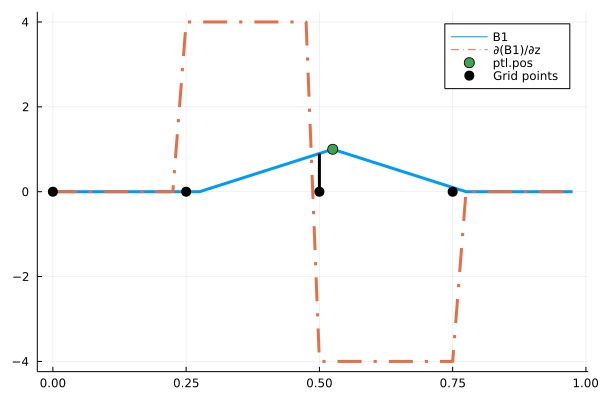
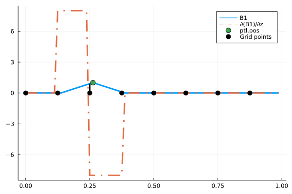

# Differentiability

Notes on differentiability of various code components
# Shape function

In a hurry, so only the basics here. In the notebooks folder, the notebook `derivatives_b1.jl`
shows the details for differentiablity of the shape functions. The graphics below visualize
how the derivative of the basic shape function b1 looks like

For 4 grid points

For 8 gridpoints

